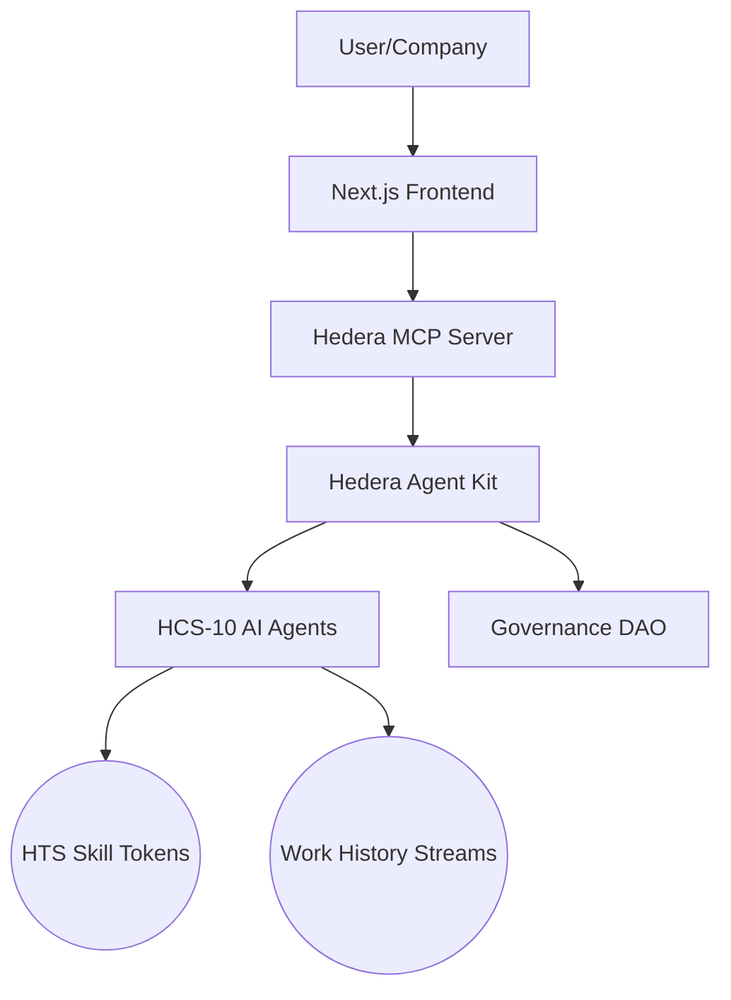

# 🌟 TalentChain Pro 🌟


> **Revolutionizing talent ecosystems with blockchain-verified skills, AI reputation oracles, and decentralized job matching**

[](https://opensource.org/licenses/MIT)
[](https://hedera.com/)
[](https://github.com/hedera-dev/hcs-10)

---

## 🚀 Vision

TalentChain Pro creates a self-evolving talent ecosystem where skills are tokenized as dynamic assets, work history is portable across platforms, and AI agents autonomously verify reputation. We're building the future of work—where talent is sovereign, reputation is objective, and opportunity is permissionless.

## ✨ Core Innovations

### 🏅 Skill Soulbound Tokens (SBTs)
- Non-transferable ERC-721 tokens representing verifiable skill credentials
- Skills automatically upgrade/downgrade based on work performance
- Example: `ReactJS L3` → `ReactJS L4` after successful project completion

### 🤖 AI Reputation Oracles
- On-chain AI agents that analyze work deliverables
- Consensus-based reputation scoring via HCS messages
- Objective, tamper-proof skill verification

### 🌊 Autonomous Job Matching Pools
- HTS-based liquidity pools for talent discovery
- Companies stake HBAR → create job pools
- Candidates stake skill tokens → join pools
- AI matching engine earns fees for successful matches

### 📜 Portable Work History
- Cross-platform work history stored as HCS streams
- Take your reputation anywhere in the Web3 ecosystem
- Immutable record of accomplishments and contributions

### 🏛️ DAO Governance
- Industry-specific skill frameworks governed by token holders
- Voting via HTS tokens to update skill requirements
- Community-driven standards for each domain

---

## 🏗️ System Architecture



## 🛠️ Tech Stack

| **Layer**       | **Technology**                          | **Hedera Integration**          |
|-----------------|-----------------------------------------|---------------------------------|
| **Frontend**    | Next.js, WalletConnect                  | Hedera Wallet Integration       |
| **Backend**     | FastAPI, Python                         | Hedera SDK for Python           |
| **AI Middleware**| Hedera AgentKit, LangChain, GROQ       | Natural Language Processing     |
| **Blockchain**  | HCS-10, HTS 2.0, Smart Contracts        | Skill Tokens & Reputation Oracles |
| **Data**        | HCS Streams, IPFS                       | Immutable Work History          |

---

## 📋 Features

### Backend API Endpoints

#### Skills API
- `POST /api/v1/skills/create` - Create a new skill token
- `GET /api/v1/skills/{token_id}` - Get skill token details
- `GET /api/v1/skills` - List skill tokens with filters
- `POST /api/v1/skills/evaluate` - Evaluate work and update skill level
- `GET /api/v1/skills/reputation/{account_id}` - Get reputation for an account

#### Pools API
- `POST /api/v1/pools/create` - Create a new job pool
- `GET /api/v1/pools/{pool_id}` - Get job pool details
- `GET /api/v1/pools` - List job pools with filters
- `POST /api/v1/pools/{pool_id}/join` - Join a pool as a candidate
- `POST /api/v1/pools/{pool_id}/leave` - Leave a pool as a candidate
- `POST /api/v1/pools/{pool_id}/match` - Make a match between company and candidate
- `GET /api/v1/pools/{pool_id}/candidates` - Get candidates in a job pool

#### MCP API (AI Integration)
- `POST /api/v1/mcp/search` - Search for talent with specific skills using NLP
- `POST /api/v1/mcp/evaluate-match` - Evaluate candidate-job match quality
- `POST /api/v1/mcp/query` - Process natural language queries through MCP server

### Smart Contracts

#### SkillToken.sol
- Soulbound ERC-721 token for skills
- Oracle-controlled metadata updates
- HIP-412 metadata standard support

#### TalentPool.sol
- Staking pools for job matching
- Platform fee management
- Match making with reputation scoring

---

## 🚀 Getting Started

### Prerequisites
- Node.js v20+
- Python 3.10+
- Hedera Testnet Account
- GROQ API Key

### Backend Setup

1. **Clone the repository**
   ```bash
   git clone https://github.com/talentchain-pro/talentchain-pro.git
   cd talentchain-pro/backend
   ```

2. **Create and activate a virtual environment**
   ```bash
   python -m venv venv
   source venv/bin/activate  # On Windows: venv\Scripts\activate
   ```

3. **Install dependencies**
   ```bash
   pip install -r requirements.txt
   ```

4. **Configure environment variables**
   ```bash
   cp .env.example .env
   # Edit .env with your Hedera account ID, private key, and other settings
   ```

5. **Run the application**
   ```bash
   uvicorn app.main:app --reload
   ```

6. **Access the API documentation**
   Open your browser and navigate to [http://localhost:8000/docs](http://localhost:8000/docs)

### Smart Contract Deployment

1. **Set up Hardhat environment**
   ```bash
   cd contracts
   npm install
   ```

2. **Deploy to Hedera Testnet**
   ```bash
   npx hardhat run scripts/deploy.ts --network testnet
   ```

3. **Update contract addresses in .env**
   ```
   CONTRACT_SKILL_TOKEN=0.0.XXXX
   ```

### MCP Server Setup

1. **Clone the MCP server repository**
   ```bash
   git clone https://github.com/mateuszm-arianelabs/hedera-mcp-server.git
   cd hedera-mcp-server
   pnpm install
   ```

2. **Configure environment**
   ```bash
   cp packages/langchain-proxy/.env.example packages/langchain-proxy/.env
   cp packages/mcp-server/.env.example packages/mcp-server/.env
   # Edit .env files with your configuration
   ```

3. **Start the MCP server**
   ```bash
   pnpm run dev
   ```

---

## 🧪 Testing

Run the test suite with:

```bash
cd backend
pytest
```

For specific test modules:

```bash
pytest tests/test_skills.py
pytest tests/test_pools.py
pytest tests/test_mcp.py
```

---

## 🌐 Competitive Advantages

1. **Anti-Sybil Protection**  
   - Skill tokens require verified work history minting

2. **Cross-Platform Portability**  
   - Take your reputation across Web3 platforms

3. **Real-Time Skill Valuation**  
   - Market-driven skill pricing via token pools

4. **Industry-Aligned Standards**  
   - Healthcare/IT/Engineering DAOs govern their domains

5. **Automated Career Progression**  
   - AI detects skill gaps → recommends upskilling paths

---

## 📊 Implementation Roadmap

### Phase 1: Skill Token Factory (Q3 2025)
- Web UI for skill token creation
- Work submission analysis MVP
- HCS-10 registry for skill token discovery

### Phase 2: Reputation Network (Q4 2025)
- Integrate 3+ AI oracle providers
- Implement stake-weighted matching
- Launch first Industry DAO (Web3 Development)

### Phase 3: Cross-Platform Portability (Q1 2026)
- HCS Stream import/export tools
- Partner integrations (LinkedIn, GitHub, Upwork)
- Mobile SDK for work history capture

### Phase 4: Governance & Scaling (Q2 2026)
- Multi-chain support via WASM contracts
- Governance voting mechanisms
- Enterprise integration APIs

---

## 🤝 Contributing

We welcome contributions to TalentChain Pro! Please see [CONTRIBUTING.md](CONTRIBUTING.md) for details on how to get started.

## 📜 License

This project is licensed under the MIT License - see the [LICENSE](LICENSE) file for details.

## 🙏 Acknowledgements

- [Hedera Hashgraph](https://hedera.com/) for their revolutionary distributed ledger technology
- [Hedera Agent Kit](https://github.com/hashgraph/hedera-agent-kit) for agent-based development tools
- [GROQ](https://groq.com/) for providing high-performance AI inference
- [LangChain](https://langchain.com/) for AI orchestration capabilities

---

<p align="center">
  
  <br>
  <i>Building the future of work, one token at a time.</i>
</p>
