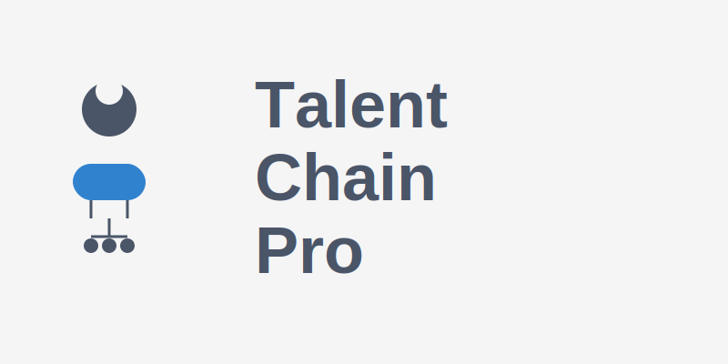
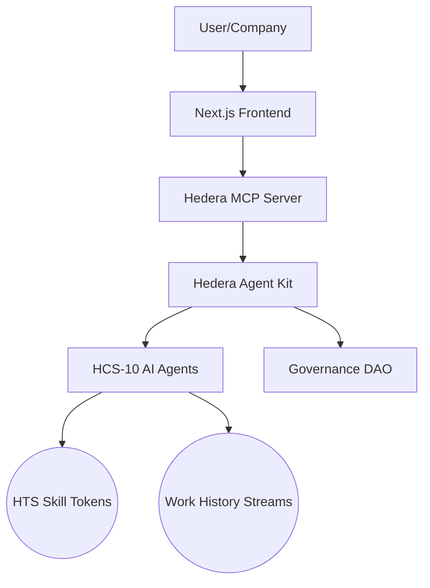

# 🌟 TalentChain Pro 🌟



> **Revolutionizing talent ecosystems with blockchain-verified skills, AI reputation oracles, and decentralized job matching**

[](https://opensource.org/licenses/MIT)
[](https://hedera.com/)
[](https://github.com/hedera-dev/hcs-10)

---

## 🚀 Vision

TalentChain Pro creates a self-evolving talent ecosystem where skills are tokenized as dynamic assets, work history is portable across platforms, and AI agents autonomously verify reputation. We're building the future of work—where talent is sovereign, reputation is objective, and opportunity is permissionless.

## ✨ Core Innovations

### 🏅 Skill Soulbound Tokens (SBTs)

- Non-transferable ERC-721 tokens representing verifiable skill credentials
- Skills automatically upgrade/downgrade based on work performance
- Example: `ReactJS L3` → `ReactJS L4` after successful project completion

### 🤖 AI Reputation Oracles

- On-chain AI agents that analyze work deliverables
- Consensus-based reputation scoring via HCS messages
- Objective, tamper-proof skill verification

### 🌊 Autonomous Job Matching Pools

- HTS-based liquidity pools for talent discovery
- Companies stake HBAR → create job pools
- Candidates stake skill tokens → join pools
- AI matching engine earns fees for successful matches

### 📜 Portable Work History

- Cross-platform work history stored as HCS streams
- Take your reputation anywhere in the Web3 ecosystem
- Immutable record of accomplishments and contributions

### 🏛️ DAO Governance

- Industry-specific skill frameworks governed by token holders
- Voting via HTS tokens to update skill requirements
- Community-driven standards for each domain

---

## 🏗️ System Architecture



## 🛠️ Tech Stack

| **Layer**         | **Technology**                   | **Hedera Integration**            |
| ----------------- | -------------------------------- | --------------------------------- |
| **Frontend**      | Next.js, WalletConnect           | Hedera Wallet Integration         |
| **Backend**       | FastAPI, Python                  | Hedera SDK for Python             |
| **AI Middleware** | Hedera AgentKit, LangChain, GROQ | Natural Language Processing       |
| **Blockchain**    | HCS-10, HTS 2.0, Smart Contracts | Skill Tokens & Reputation Oracles |
| **Data**          | HCS Streams, IPFS                | Immutable Work History            |

---

## 📋 Features

### Backend API Endpoints

#### Skills API

- `POST /api/v1/skills/create` - Create a new skill token
- `GET /api/v1/skills/{token_id}` - Get skill token details
- `GET /api/v1/skills` - List skill tokens with filters
- `POST /api/v1/skills/evaluate` - Evaluate work and update skill level
- `GET /api/v1/skills/reputation/{account_id}` - Get reputation for an account

#### Pools API

- `POST /api/v1/pools/create` - Create a new job pool
- `GET /api/v1/pools/{pool_id}` - Get job pool details
- `GET /api/v1/pools` - List job pools with filters
- `POST /api/v1/pools/{pool_id}/join` - Join a pool as a candidate
- `POST /api/v1/pools/{pool_id}/leave` - Leave a pool as a candidate
- `POST /api/v1/pools/{pool_id}/match` - Make a match between company and candidate
- `GET /api/v1/pools/{pool_id}/candidates` - Get candidates in a job pool

#### MCP API (AI Integration)

- `POST /api/v1/mcp/search` - Search for talent with specific skills using NLP
- `POST /api/v1/mcp/evaluate-match` - Evaluate candidate-job match quality
- `POST /api/v1/mcp/query` - Process natural language queries through MCP server

### Smart Contracts

#### SkillToken.sol

- Soulbound ERC-721 token for skills
- Oracle-controlled metadata updates
- HIP-412 metadata standard support

#### TalentPool.sol

- Staking pools for job matching
- Platform fee management
- Match making with reputation scoring

---

## 🚀 Getting Started

### Prerequisites

- Node.js v20+
- Python 3.10+
- Hedera Testnet Account
- GROQ API Key

### Backend Setup

1. **Clone the repository**

   ```bash
   git clone https://github.com/talentchain-pro/talentchain-pro.git
   cd talentchain-pro/backend
   ```

2. **Create and activate a virtual environment**

   ```bash
   python -m venv venv
   source venv/bin/activate  # On Windows: venv\Scripts\activate
   ```

3. **Install dependencies**

   ```bash
   pip install -r requirements.txt
   ```

4. **Configure environment variables**

   ```bash
   cp .env.example .env
   # Edit .env with your Hedera account ID, private key, and other settings
   ```

5. **Run the application**

   ```bash
   uvicorn app.main:app --reload
   ```

6. **Access the API documentation**
   Open your browser and navigate to [http://localhost:8000/docs](http://localhost:8000/docs)

### Smart Contract Deployment

1. **Set up Hardhat environment**

   ```bash
   cd contracts
   npm install
   ```

2. **Deploy to Hedera Testnet**

   ```bash
   npx hardhat run scripts/deploy.ts --network testnet
   ```

3. **Update contract addresses in .env**
   ```
   CONTRACT_SKILL_TOKEN=0.0.XXXX
   ```

### MCP Server Setup

1. **Clone the MCP server repository**

   ```bash
   git clone https://github.com/mateuszm-arianelabs/hedera-mcp-server.git
   cd hedera-mcp-server
   pnpm install
   ```

2. **Configure environment**

   ```bash
   cp packages/langchain-proxy/.env.example packages/langchain-proxy/.env
   cp packages/mcp-server/.env.example packages/mcp-server/.env
   # Edit .env files with your configuration
   ```

3. **Start the MCP server**
   ```bash
   pnpm run dev
   ```

---

## 🧪 Testing

Run the test suite with:

```bash
cd backend
pytest
```

For specific test modules:

```bash
pytest tests/test_skills.py
pytest tests/test_pools.py
pytest tests/test_mcp.py
```

---

## 🌐 Competitive Advantages

1. **Anti-Sybil Protection**

   - Skill tokens require verified work history minting

2. **Cross-Platform Portability**

   - Take your reputation across Web3 platforms

3. **Real-Time Skill Valuation**

   - Market-driven skill pricing via token pools

4. **Industry-Aligned Standards**

   - Healthcare/IT/Engineering DAOs govern their domains

5. **Automated Career Progression**
   - AI detects skill gaps → recommends upskilling paths

---

## 📊 Implementation Roadmap

### Phase 1: Skill Token Factory (Q3 2025)

- Web UI for skill token creation
- Work submission analysis MVP
- HCS-10 registry for skill token discovery

### Phase 2: Reputation Network (Q4 2025)

- Integrate 3+ AI oracle providers
- Implement stake-weighted matching
- Launch first Industry DAO (Web3 Development)

### Phase 3: Cross-Platform Portability (Q1 2026)

- HCS Stream import/export tools
- Partner integrations (LinkedIn, GitHub, Upwork)
- Mobile SDK for work history capture

### Phase 4: Governance & Scaling (Q2 2026)

- Multi-chain support via WASM contracts
- Governance voting mechanisms
- Enterprise integration APIs

---

## 🤝 Contributing

We welcome contributions to TalentChain Pro! Please see [CONTRIBUTING.md](CONTRIBUTING.md) for details on how to get started.

## 📜 License

This project is licensed under the MIT License - see the [LICENSE](LICENSE) file for details.

## 🙏 Acknowledgements

- [Hedera Hashgraph](https://hedera.com/) for their revolutionary distributed ledger technology
- [Hedera Agent Kit](https://github.com/hashgraph/hedera-agent-kit) for agent-based development tools
- [GROQ](https://groq.com/) for providing high-performance AI inference
- [LangChain](https://langchain.com/) for AI orchestration capabilities

---

<p align="center">
  
  <br>
  <i>Building the future of work, one token at a time.</i>
</p>

## 📸 Application Screenshots


_The TalentChain Pro interface showcasing the dashboard with skill tokens, job pools, reputation tracking, and wallet integration._

## � Additional Features

### Smart Contract Features

- ✅ Soulbound skill token creation and management
- ✅ Dynamic skill level upgrades based on work performance
- ✅ Job pool creation with HBAR staking mechanisms
- ✅ AI oracle integration for reputation verification
- ✅ Comprehensive access control and security measures
- ✅ Event emission for all operations
- ✅ Gas-optimized design patterns

### Frontend Features

- ✅ Modern, responsive UI with Tailwind CSS and Framer Motion
- ✅ Real-time skill token and job pool monitoring
- ✅ Multi-wallet support (HashPack, MetaMask, Blade, WalletConnect)
- ✅ AI-powered talent matching and job recommendations
- ✅ Cross-platform work history visualization
- ✅ Mobile-friendly design with responsive components

## 🦊 MetaMask Wallet Setup Guide

### Step 1: Download and Install MetaMask

1. **Visit the Official MetaMask Website**

   - Go to [https://metamask.io/](https://metamask.io/)
   - Click "Download" button

2. **Install Browser Extension**

   - Choose your browser (Chrome, Firefox, Edge, or Brave)
   - Click "Install MetaMask for [Your Browser]"
   - Add the extension to your browser
   - Pin the MetaMask extension to your browser toolbar for easy access

3. **Initial Setup**
   - Click the MetaMask fox icon in your browser
   - Choose "Create a new wallet" (for new users) or "Import an existing wallet"
   - Create a strong password (at least 8 characters)
   - **⚠️ IMPORTANT**: Write down your Secret Recovery Phrase and store it safely!

### Step 2: Configure MetaMask for Hedera Network

MetaMask doesn't include Hedera networks by default, so we need to add them manually:

1. **Open MetaMask Settings**

   - Click the MetaMask icon
   - Click your account avatar (top right)
   - Select "Settings" → "Networks" → "Add Network"

2. **Add Hedera Testnet Network**

   ```
   Network Name: Hedera Testnet
   New RPC URL: https://testnet.hashio.io/api
   Chain ID: 296
   Currency Symbol: HBAR
   Block Explorer URL: https://hashscan.io/testnet
   ```

3. **Add Hedera Mainnet Network** (Optional - for production use)

   ```
   Network Name: Hedera Mainnet
   New RPC URL: https://mainnet.hashio.io/api
   Chain ID: 295
   Currency Symbol: HBAR
   Block Explorer URL: https://hashscan.io/mainnet
   ```

4. **Save and Switch Networks**
   - Click "Save" to add the network
   - Switch to "Hedera Testnet" from the network dropdown

### Step 3: Import Your Hedera Account

If you already have a Hedera account, you can import it into MetaMask:

1. **Get Your Private Key**

   - From Hedera Portal or your existing wallet
   - **⚠️ WARNING**: Never share your private key with anyone!

2. **Import Account in MetaMask**

   - Click your account avatar → "Import Account"
   - Select "Private Key" as import type
   - Paste your Hedera private key (with or without 0x prefix)
   - Click "Import"

3. **Verify Import**
   - Your account should appear with your HBAR balance
   - Account ID format: 0.0.xxxxxx

## 💰 Hedera Account Creation and Funding Guide

### Step 1: Create a Hedera Testnet Account

1. **Visit Hedera Portal**

   - Go to [https://portal.hedera.com/](https://portal.hedera.com/)
   - Click "Create Account" or "Get Started"

2. **Choose Account Type**

   - Select "Testnet" for development and testing
   - Click "Create Testnet Account"

3. **Account Creation**

   - The portal will generate a new account automatically
   - You'll receive:
     - **Account ID** (format: 0.0.xxxxxx)
     - **Public Key** (starts with 302a300506...)
     - **Private Key** (starts with 302e020100... or hex format)

4. **Save Your Credentials**
   ```
   Account ID: 0.0.1234567
   Private Key: 302e020100300506032b657004220420...
   Public Key: 302a300506032b6570032100...
   ```
   - **⚠️ CRITICAL**: Save these credentials securely!
   - Store them in a password manager or secure note-taking app

### Step 2: Fund Your Account with Testnet HBAR

1. **Automatic Funding**

   - New testnet accounts usually receive 1000 HBAR automatically
   - Wait 1-2 minutes for the funding to appear

2. **Manual Faucet (if needed)**

   - Visit [https://portal.hedera.com/](https://portal.hedera.com/)
   - Log in with your account credentials
   - Look for "Testnet Faucet" or "Get HBAR" button
   - Request additional HBAR (usually 1000 HBAR per request)

3. **Alternative Faucet Sources**
   - [Hedera Faucet](https://portal.hedera.com/) (Official)
   - Community faucets (check Hedera Discord for links)

### Step 3: Verify Your Account

1. **Check Balance on HashScan**

   - Visit [https://hashscan.io/testnet](https://hashscan.io/testnet)
   - Search for your Account ID (0.0.xxxxxx)
   - Verify your HBAR balance appears

2. **Import to MetaMask**
   - Follow the MetaMask setup guide above
   - Import your account using the private key
   - Verify the balance shows in MetaMask

## 🚀 Complete Installation Guide

### Prerequisites Checklist

Before starting, ensure you have these installed:

- ✅ **Node.js** (v18.0.0 or higher) - [Download here](https://nodejs.org/)
- ✅ **npm** (comes with Node.js) or **yarn**
- ✅ **Git** - [Download here](https://git-scm.com/)
- ✅ **MetaMask Browser Extension** (see guide above)
- ✅ **Hedera Testnet Account** with HBAR (see guide above)
- ✅ **Code Editor** (VS Code recommended)

**Check Your Versions:**

```bash
node --version    # Should be v18.0.0 or higher
npm --version     # Should be 8.0.0 or higher
git --version     # Any recent version
```

### Step 1: Clone the Repository

1. **Open Terminal/Command Prompt**

   - Windows: Press `Win + R`, type `cmd`, press Enter
   - Mac: Press `Cmd + Space`, type "Terminal", press Enter
   - Linux: Press `Ctrl + Alt + T`

2. **Navigate to Your Desired Directory**

   ```bash
   # Example: Navigate to Desktop
   cd Desktop

   # Or create a new projects folder
   mkdir blockchain-projects
   cd blockchain-projects
   ```

3. **Clone the Repository**
   ```bash
   git clone https://github.com/austinLorenzMccoy/talentchainpro.git
   cd talentchainpro
   ```

### Step 2: Install Dependencies

1. **Install Root Dependencies**

   ```bash
   npm install
   ```

   **Expected Output:**

   ```
   added 245 packages, and audited 246 packages in 15s
   ```

2. **Install Smart Contract Dependencies**

   ```bash
   cd smart-contract
   npm install
   cd ..
   ```

3. **Install Frontend Dependencies**
   ```bash
   cd frontend
   npm install
   cd ..
   ```

**⚠️ Troubleshooting Installation Issues:**

- If you get permission errors, try: `npm install --no-optional`
- For Windows users with Python errors: `npm install --ignore-scripts`
- If installation fails, delete `node_modules` and try again

### Step 3: Create Environment Files and Configure TalentChain Pro

1. **Create Environment Files**

   ```bash
   # Copy the example environment file for the backend
   cd backend
   cp .env.example .env

   # For Windows users:
   copy .env.example .env
   cd ..
   ```

2. **Configure Backend Environment File (backend/.env)**

   Open `backend/.env` in your code editor and update with your Hedera account details:

   ```env
   # Hedera Network Configuration
   HEDERA_NETWORK=testnet
   HEDERA_ACCOUNT_ID=0.0.1234567
   HEDERA_PRIVATE_KEY=302e020100300506032b657004220420abcd1234...

   # API Configuration
   API_HOST=0.0.0.0
   API_PORT=8000
   API_RELOAD=true

   # GROQ API Configuration (for AI features)
   GROQ_API_KEY=your_groq_api_key_here

   # Contract Addresses (will be populated after deployment)
   CONTRACT_SKILL_TOKEN=
   CONTRACT_TALENT_POOL=

   # Database Configuration (if using)
   DATABASE_URL=sqlite:///./talentchain.db
   ```

3. **Configure Frontend Environment**

   ```bash
   cd frontend
   cp .env.example .env.local
   ```

   Edit `frontend/.env.local`:

   ```env
   # Hedera Network
   NEXT_PUBLIC_HEDERA_NETWORK=testnet

   # TalentChain Pro Configuration
   NEXT_PUBLIC_APP_NAME=TalentChain Pro
   NEXT_PUBLIC_APP_DESCRIPTION=Blockchain-based talent ecosystem on Hedera

   # API Configuration
   NEXT_PUBLIC_API_URL=http://localhost:8000/api/v1

   # WalletConnect Configuration
   NEXT_PUBLIC_WALLET_CONNECT_PROJECT_ID=your_project_id_here

   # Contract Addresses (will be populated after deployment)
   NEXT_PUBLIC_CONTRACT_SKILL_TOKEN=
   NEXT_PUBLIC_CONTRACT_TALENT_POOL=
   ```

### Step 4: Deploy TalentChain Pro Smart Contracts

1. **Navigate to Contracts Directory**

   ```bash
   cd contracts
   npm install
   ```

2. **Compile the Smart Contracts**

   ```bash
   npx hardhat compile
   ```

   **Expected Output:**

   ```
   Compiled 2 Solidity files successfully
   ✓ SkillTokenSimple.sol compiled
   ✓ TalentPoolSimple.sol compiled
   ```

3. **Deploy to Hedera Testnet**

   ```bash
   npx hardhat run scripts/deploy.js --network testnet
   ```

   **Expected Output:**

   ```
   🚀 Starting TalentChain Pro Contract Deployment...
   🌐 Connected to Hedera Testnet
   📄 Contract bytecode loaded successfully
   ⏳ Deploying SkillToken contract...
   ✅ SkillToken deployed: 0.0.6285476
   ⏳ Deploying TalentPool contract...
   ✅ TalentPool deployed: 0.0.6285477
   � Linking contracts...
   ✅ Contracts deployed and linked successfully!
   ```

4. **Verify Deployment**
   - The script automatically updates your environment files
   - Check that contract addresses are now populated in your `.env` files
   - Visit HashScan to see your deployed contracts

### Step 5: Start the TalentChain Pro Backend

1. **Navigate to Backend Directory**

   ```bash
   cd ../backend
   ```

2. **Create Python Virtual Environment**

   ```bash
   python -m venv venv

   # Activate virtual environment
   # On macOS/Linux:
   source venv/bin/activate

   # On Windows:
   venv\Scripts\activate
   ```

3. **Install Python Dependencies**

   ```bash
   pip install -r requirements.txt
   ```

4. **Start the FastAPI Backend**

   ```bash
   uvicorn app.main:app --reload --host 0.0.0.0 --port 8000
   ```

   **Expected Output:**

   ```
   INFO:     Uvicorn running on http://0.0.0.0:8000 (Press CTRL+C to quit)
   INFO:     Started reloader process [28720] using StatReload
   INFO:     Started server process [28722]
   INFO:     Waiting for application startup.
   ```

5. **Verify Backend**
   - Visit `http://localhost:8000/docs` to see the API documentation
   - Test the health endpoint: `http://localhost:8000/health`

### Step 6: Start the TalentChain Pro Frontend

1. **Navigate to Frontend Directory (New Terminal)**

   ```bash
   cd frontend
   ```

2. **Start Development Server**

   ```bash
   npm run dev
   ```

   **Expected Output:**

   ```
   ready - started server on 0.0.0.0:3000, url: http://localhost:3000
   ```

3. **Open TalentChain Pro**
   - Visit `http://localhost:3000` in your browser
   - You should see the TalentChain Pro interface

### Step 7: Connect Your Wallet and Test TalentChain Pro

1. **Connect Your Wallet**

   - Click "Connect Wallet" button in the top-right
   - Choose between HashPack or MetaMask
   - Approve the connection in your wallet
   - Ensure you're on Hedera Testnet network

2. **Test TalentChain Pro Features**

   - **Create Skill Tokens**: Navigate to the Skills section and create your first skill token
   - **Browse Job Pools**: Check out available job opportunities
   - **Join a Pool**: Apply to a job pool with your skill tokens
   - **Monitor Reputation**: Track your reputation score and work history
   - **View Transactions**: Check transaction history on HashScan

3. **Test API Endpoints**
   - Visit `http://localhost:8000/docs` for interactive API documentation
   - Test skill token creation and job pool operations
   - Try the AI-powered talent matching features

### Verification Checklist

✅ **TalentChain Pro Setup Complete When:**

- [ ] All dependencies installed without errors
- [ ] Environment files configured with your account details
- [ ] Smart contracts compiled successfully
- [ ] SkillToken and TalentPool contracts deployed to Hedera testnet
- [ ] Backend API starts on `http://localhost:8000`
- [ ] Frontend starts on `http://localhost:3000`
- [ ] Wallet connects successfully (HashPack or MetaMask)
- [ ] Skill token creation works
- [ ] Job pool operations function correctly
- [ ] API documentation accessible at `/docs`
- [ ] Transactions appear in HashScan explorer

### Common Installation Issues and Solutions

#### Issue: "Node.js version too old"

**Solution:**

```bash
# Update Node.js to latest LTS version
# Visit https://nodejs.org/ and download latest version
```

#### Issue: "HEDERA_PRIVATE_KEY not found"

**Solution:**

- Double-check your `.env` file has the correct private key
- Ensure no extra spaces or quotes around the key
- Verify the key starts with `302e020100...` or is in hex format

#### Issue: "Insufficient Account Balance"

**Solution:**

- Get more testnet HBAR from [portal.hedera.com](https://portal.hedera.com/)
- Wait a few minutes for funding to appear
- Check your balance on [hashscan.io/testnet](https://hashscan.io/testnet)

#### Issue: "MetaMask connection failed"

**Solution:**

- Ensure MetaMask is installed and unlocked
- Verify Hedera Testnet network is added to MetaMask
- Check that you're on the correct network (Chain ID: 296)

#### Issue: "Contract deployment failed"

**Solution:**

- Verify your account has sufficient HBAR (need ~10 HBAR for TalentChain Pro deployment)
- Check your private key is correct in `backend/.env`
- Ensure you're connected to testnet, not mainnet
- Verify Hardhat configuration in `contracts/hardhat.config.js`

#### Issue: "Backend API not starting"

**Solution:**

- Ensure Python virtual environment is activated
- Check all dependencies are installed: `pip install -r requirements.txt`
- Verify environment variables in `backend/.env`
- Check port 8000 is not already in use

#### Issue: "GROQ API errors"

**Solution:**

- Get a valid GROQ API key from [console.groq.com](https://console.groq.com)
- Update `GROQ_API_KEY` in `backend/.env`
- Check GROQ service status and rate limits

## 📚 Understanding Hedera Blockchain

### What is Hedera?

Hedera is a public distributed ledger that offers:

- **High Performance**: 10,000+ transactions per second
- **Low Fees**: Predictable, low-cost transactions
- **Energy Efficient**: Proof-of-Stake consensus
- **Enterprise Grade**: Built for real-world applications

### Key Concepts

#### 1. **Accounts**

- Every user has a unique Account ID (format: `0.0.xxxxx`)
- Accounts hold HBAR (Hedera's native cryptocurrency)
- Required for all blockchain interactions

#### 2. **Smart Contracts**

- Self-executing contracts with terms directly written into code
- Deployed to the blockchain with a unique Contract ID
- Can hold and transfer HBAR, store data, and execute logic

#### 3. **Transactions**

- All blockchain interactions are transactions
- Require HBAR to pay for network fees
- Provide cryptographic proof of execution

#### 4. **Consensus**

- Hedera uses Hashgraph consensus algorithm
- Provides fast finality and high throughput
- More energy-efficient than traditional blockchains

## 🔧 TalentChain Pro Project Structure

```
talentchainpro/
├── backend/                    # FastAPI backend application
│   ├── app/
│   │   ├── main.py            # FastAPI application entry point
│   │   ├── api/               # API route handlers
│   │   ├── models/            # Pydantic data models
│   │   ├── services/          # Business logic services
│   │   └── utils/             # Utility functions
│   ├── requirements.txt       # Python dependencies
│   └── .env                   # Backend environment variables
├── contracts/                  # Smart contract code
│   ├── contracts/             # Solidity contracts
│   │   ├── SkillTokenSimple.sol
│   │   └── TalentPoolSimple.sol
│   ├── scripts/               # Deployment scripts
│   ├── test/                  # Contract tests
│   └── hardhat.config.js      # Hardhat configuration
├── frontend/                   # Next.js frontend application
│   ├── app/                   # App router pages
│   ├── components/            # React components
│   │   ├── dashboard/         # Dashboard components
│   │   ├── landing/           # Landing page components
│   │   ├── navigation/        # Navigation components
│   │   ├── ui/                # UI components
│   │   └── wallet/            # Wallet integration
│   ├── hooks/                 # Custom React hooks
│   ├── lib/                   # Utility libraries
│   │   ├── api/               # API client functions
│   │   ├── hedera/            # Hedera SDK integrations
│   │   ├── types/             # TypeScript type definitions
│   │   └── wallet/            # Wallet connection logic
│   └── public/                # Static assets
├── docs/                      # Documentation
├── README.md                  # This comprehensive guide
└── .env.example              # Environment variables template
```

## 💡 TalentChain Pro Smart Contracts Deep Dive

### SkillTokenSimple.sol Explained

Our skill token contract includes several key components:

#### State Variables

```solidity
mapping(uint256 => string) private _tokenCategories;  // Skill categories
mapping(uint256 => uint256) private _tokenLevels;     // Skill levels
mapping(address => bool) private _oracles;            // Authorized oracles
uint256 private _tokenIdCounter;                       // Token ID counter
```

#### Key Functions

1. **createSkillToken()** - Mint new skill tokens
2. **updateSkillLevel()** - Oracle-controlled level updates
3. **getSkillInfo()** - Get token metadata
4. **upgradeSkill()** - Level progression mechanism
5. **addOracle()** - Oracle management (admin only)

### TalentPoolSimple.sol Explained

The talent pool contract manages job matching:

#### State Variables

```solidity
struct Pool {
    address company;           // Pool creator
    string description;        // Job description
    uint256[] requiredSkills;  // Required skill token IDs
    uint256 stakeAmount;       // HBAR stake amount
    uint256 salary;           // Job salary
    PoolStatus status;        // Pool status
    address[] applicants;     // Applied candidates
}
```

#### Key Functions

1. **createPool()** - Create new job pools
2. **applyToPool()** - Apply with skill tokens
3. **makeMatch()** - Finalize talent matching
4. **withdrawStake()** - Retrieve staked HBAR
5. **getPoolInfo()** - Get pool details

#### Security Features

- **Access Control**: Owner and oracle permissions
- **Stake Management**: Automated HBAR handling
- **Input Validation**: Comprehensive parameter checks
- **Event Logging**: All operations emit events for transparency
- **Reentrancy Protection**: SafeMath and proper state management

### Gas Optimization

Both contracts are optimized for gas efficiency:

- Uses `private` variables with public getters
- Efficient storage layout using structs
- Minimal external calls and loops
- Batch operations where possible

## 🎨 TalentChain Pro Frontend Architecture

### Technology Stack

- **Next.js 14**: React framework with App Router
- **TypeScript**: Type-safe JavaScript development
- **Tailwind CSS**: Utility-first CSS framework
- **Framer Motion**: Animation and gesture library
- **Hedera SDK**: Official Hedera JavaScript SDK
- **WalletConnect**: Multi-wallet integration
- **React Hooks**: State management and side effects

### Key Components

#### 1. **WalletButton**

Handles multi-wallet connection (HashPack, MetaMask) and displays connection status.

#### 2. **DashboardOverview**

Central dashboard showing skill tokens, job pools, and reputation metrics.

#### 3. **SkillTokensWidget**

Displays user's skill tokens with levels and upgrade paths.

#### 4. **JobPoolsWidget**

Shows available job pools and application status.

#### 5. **ReputationWidget**

Tracks and displays user reputation score and work history.

#### 6. **MobileMenu**

Mobile-optimized navigation with wallet integration.

### Custom Hooks

#### useHederaWallet

Manages wallet connection state and operations across multiple wallet types.

#### useDashboardData

Fetches and manages all dashboard-related data from the backend API.

#### useRealTimeUpdates

Handles real-time updates for skill tokens and job pools.

### API Integration

The frontend communicates with the FastAPI backend through:

- RESTful API endpoints for CRUD operations
- WebSocket connections for real-time updates
- AI-powered recommendations and matching

## 🔐 TalentChain Pro Security Considerations

### Smart Contract Security

- **Access Control**: Oracle and admin permissions properly managed
- **Reentrancy Protection**: All state changes follow checks-effects-interactions pattern
- **Input Validation**: All user inputs validated before processing
- **Soulbound Tokens**: Non-transferable skill tokens prevent fraud
- **Stake Protection**: HBAR stakes locked during active job pools

### Backend Security

- **API Authentication**: JWT tokens for authenticated endpoints
- **Rate Limiting**: Protection against API abuse
- **Input Sanitization**: All inputs validated and sanitized
- **Environment Variables**: Sensitive data properly managed
- **CORS Configuration**: Proper cross-origin resource sharing

### Frontend Security

- **Wallet Integration**: Secure wallet connection handling
- **Private Key Protection**: No private keys stored in frontend
- **HTTPS Only**: Production deployment uses HTTPS
- **Content Security Policy**: Protection against XSS attacks
- **Error Handling**: Graceful error handling without exposing sensitive data

## 🧪 Testing TalentChain Pro

### Backend API Tests

Run the comprehensive backend test suite:

```bash
cd backend
pytest tests/
```

Tests cover:

- **Skills API**: Token creation, level updates, reputation tracking
- **Pools API**: Pool creation, application process, matching logic
- **MCP Integration**: AI-powered features and natural language processing
- **Authentication**: JWT token handling and permissions
- **Error Handling**: Edge cases and error conditions

### Smart Contract Tests

Run contract tests:

```bash
cd contracts
npx hardhat test
```

Tests cover:

- **SkillToken**: Minting, level updates, oracle permissions
- **TalentPool**: Pool creation, staking, matching mechanisms
- **Access Control**: Admin and oracle permissions
- **Edge Cases**: Boundary conditions and error states
- **Gas Optimization**: Efficient contract operations

### Frontend Tests

Run frontend tests:

```bash
cd frontend
npm run test
```

### Integration Testing

Test the full TalentChain Pro ecosystem:

```bash
cd backend
python scripts/test_integration.py
```

## 🚀 Deployment Guide

### Smart Contract Deployment

1. **Prepare Environment**

   ```bash
   # Ensure you have testnet HBAR (10+ HBAR recommended)
   # Update contracts environment variables
   cd contracts
   ```

2. **Compile Contracts**

   ```bash
   npx hardhat compile
   ```

3. **Deploy to Testnet**

   ```bash
   npx hardhat run scripts/deploy.js --network testnet
   ```

4. **Verify Deployment**
   ```bash
   npx hardhat run scripts/verify.js --network testnet
   ```

### Backend Deployment

#### Docker Deployment (Recommended)

1. **Build Docker Image**

   ```bash
   cd backend
   docker build -t talentchain-pro-backend .
   ```

2. **Run Container**

   ```bash
   docker run -p 8000:8000 --env-file .env talentchain-pro-backend
   ```

#### Manual Deployment

```bash
cd backend
pip install -r requirements.txt
uvicorn app.main:app --host 0.0.0.0 --port 8000
```

### Frontend Deployment

#### Vercel (Recommended)

1. **Connect Repository**

   - Import your GitHub repository to Vercel
   - Configure build settings for Next.js

2. **Environment Variables**

   ```
   NEXT_PUBLIC_HEDERA_NETWORK=testnet
   NEXT_PUBLIC_CONTRACT_SKILL_TOKEN=0.0.YOUR_SKILL_CONTRACT
   NEXT_PUBLIC_CONTRACT_TALENT_POOL=0.0.YOUR_POOL_CONTRACT
   NEXT_PUBLIC_API_URL=https://your-backend-url.com/api/v1
   NEXT_PUBLIC_WALLET_CONNECT_PROJECT_ID=your_project_id
   ```

3. **Deploy**
   - Vercel will automatically deploy on push to main branch

#### Manual Deployment

```bash
cd frontend
npm run build
npm run start
```

## 🔧 Configuration

### Network Configuration

TalentChain Pro supports multiple Hedera networks:

- **Testnet**: For development and testing
- **Mainnet**: For production deployment
- **Previewnet**: For preview features

Configure in `backend/.env`:

```env
HEDERA_NETWORK=testnet  # or mainnet, previewnet
```

### Smart Contract Configuration

Customize contract behavior in the Solidity files:

```solidity
// SkillTokenSimple.sol
uint256 public constant MAX_SKILL_LEVEL = 10;    // Maximum skill level
uint256 public constant MIN_SKILL_LEVEL = 1;     // Minimum skill level

// TalentPoolSimple.sol
uint256 public constant MIN_STAKE_AMOUNT = 100;  // Minimum HBAR stake
uint256 public constant PLATFORM_FEE = 5;        // Platform fee percentage
```

### AI Configuration

Configure AI features in `backend/.env`:

```env
# GROQ Configuration
GROQ_API_KEY=your_groq_api_key
GROQ_MODEL=mixtral-8x7b-32768

# AI Oracle Settings
AI_CONFIDENCE_THRESHOLD=0.8
AI_EVALUATION_ENABLED=true
```

## 🐛 Troubleshooting

### Common Issues

#### 1. **"Insufficient Account Balance"**

- **Cause**: Not enough HBAR for transaction fees
- **Solution**: Get testnet HBAR from [Hedera Portal](https://portal.hedera.com/)

#### 2. **"Skill Token Creation Failed"**

- **Cause**: Insufficient HBAR or invalid parameters
- **Solution**: Ensure sufficient HBAR balance and valid skill category

#### 3. **"Job Pool Application Failed"**

- **Cause**: Missing required skill tokens or pool is full
- **Solution**: Obtain required skill tokens or try different pools

#### 4. **"AI Oracle Not Responding"**

- **Cause**: GROQ API issues or configuration problems
- **Solution**: Check GROQ API key and service status

### Debug Mode

Enable debug logging:

```env
NODE_ENV=development
DEBUG=true
```

### TalentChain Pro Resources

- [TalentChain Pro Documentation](./docs/)
- [API Reference](http://localhost:8000/docs)
- [Smart Contract Source](./contracts/)
- [Frontend Components](./frontend/components/)

### Hedera & Web3 Learning

- [Hedera Documentation](https://docs.hedera.com/)
- [Hedera Developer Portal](https://hedera.com/developers)
- [Hedera SDK Documentation](https://docs.hedera.com/hedera/sdks-and-apis)
- [Web3 University](https://www.web3.university/)
- [Solidity Documentation](https://docs.soliditylang.org/)

### AI & Machine Learning

- [GROQ Documentation](https://console.groq.com/docs)
- [LangChain Documentation](https://python.langchain.com/)
- [Hedera Agent Kit](https://github.com/hashgraph/hedera-agent-kit)

## 🤝 Contributing to TalentChain Pro

We welcome contributions! Please see our [Contributing Guide](CONTRIBUTING.md) for details.

### Development Workflow

1. Fork the repository
2. Create a feature branch
3. Make your changes
4. Add tests if applicable
5. Submit a pull request

## 📄 License

This project is licensed under the MIT License - see the [LICENSE](LICENSE) file for details.

## 🙏 Acknowledgments

- **Hedera Team** for the excellent blockchain platform and developer tools
- **GROQ Team** for providing high-performance AI inference capabilities
- **LangChain** for AI orchestration and natural language processing
- **HashPack Team** for seamless wallet integration
- **OpenZeppelin** for smart contract security patterns
- **Next.js Team** for the amazing React framework

## 📞 Support

- **GitHub Issues**: [Report bugs or request features](https://github.com/austinLorenzMccoy/talentchainpro/issues)
- **Discord**: Join the [Hedera Discord](https://discord.gg/hedera)
- **Documentation**: Check our [detailed docs](./docs/)
- **API Documentation**: Visit `http://localhost:8000/docs` when running locally

---

**Happy Building! 🚀**

_TalentChain Pro - Building the future of work, one token at a time._
