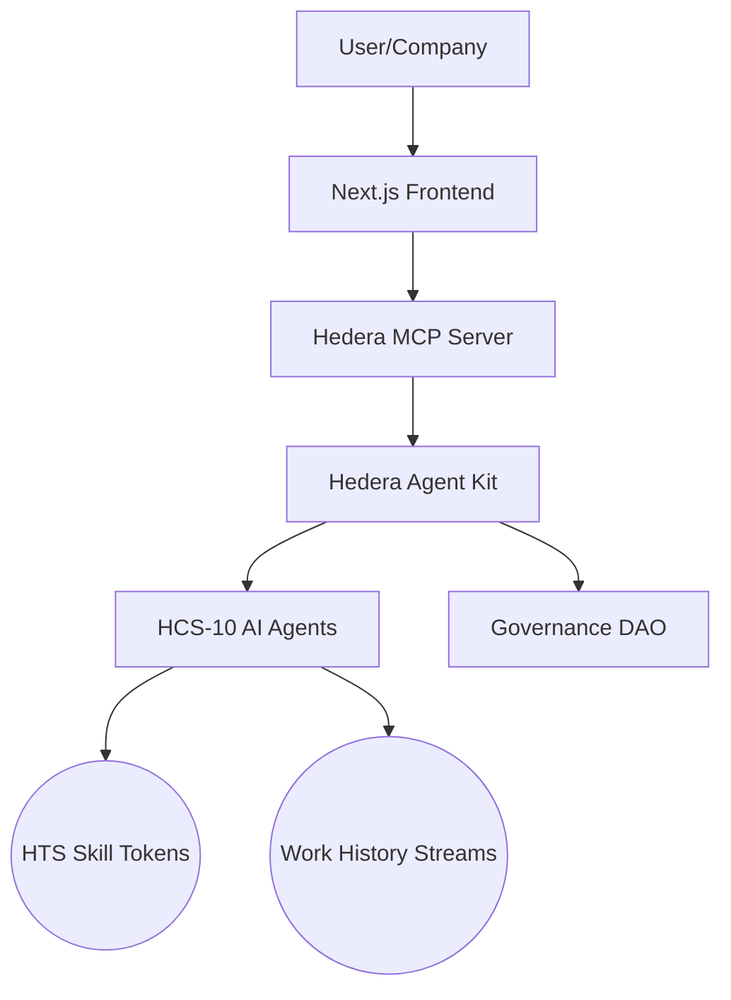
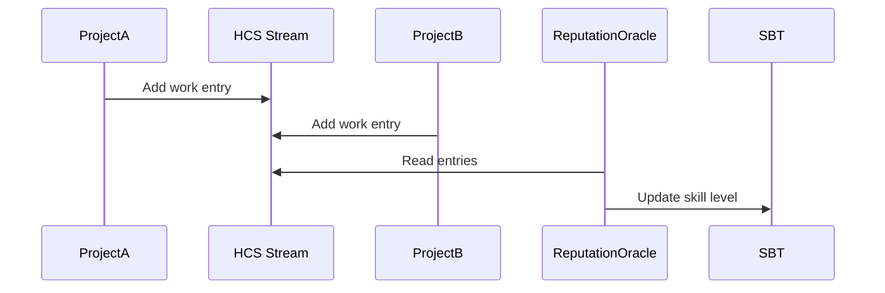

### **TalentChain Pro: AI-Driven Talent Ecosystem with Hedera HCS-10 & AgentKit**  
**PRD Version 1.0**  
*Leveraging HCS-10 OpenConvAI, Hedera AgentKit, and MCP Server for decentralized talent matching*

---

### **1. Executive Summary**  
**Vision**: Create a self-evolving talent ecosystem where skills are tokenized as dynamic assets, work history is portable across platforms, and AI agents autonomously verify reputation.  
**Core Innovation**:  
- Replace static profiles with **Skill Soulbound Tokens (SBTs)**  
- Implement **AI Reputation Oracles** using HCS-10  
- Introduce **Job Matching Pools** with staked HTS tokens  
- Govern skill standards via **Industry DAOs**  

---

### **2. System Architecture**  


#### **Tech Stack**  
| **Layer**       | **Technology**                          | **Hedera Integration**          |
|-----------------|-----------------------------------------|---------------------------------|
| **Frontend**    | Next.js, WalletConnect                  | Hedera Wallet Integration       |
| **AI Middleware**| Hedera AgentKit, LangChain              | Natural Language Processing     |
| **Blockchain**  | HCS-10, HTS 2.0, Smart Contracts 2.0    | Skill Tokens & Reputation Oracles |
| **Data**        | HCS Streams, IPFS                       | Immutable Work History          |

---

### **3. Core Features & Implementation**  

#### **3.1 Skill Soulbound Tokens (SBTs)**  
*Tokenize verifiable skills as dynamic NFTs*  
**Workflow**:  
1. **Skill Minting**:  
   ```typescript
   // Using HederaAgentKit
   const tokenId = await agentKit.hts()
     .createNonFungibleToken({
       name: `ReactJS_L4_${userId}`,
       symbol: 'SKILL',
       metadata: JSON.stringify({ skill: "ReactJS", level: 4 })
     })
     .execute();
   ```
2. **Dynamic Upgrades**:  
   - AI Oracle monitors work deliverables → triggers token metadata updates via HCS-10 messages  
   - Example HCS-10 message:  
     ```json
     {
       "p": "hcs-10",
       "op": "skill_upgrade",
       "token_id": "0.0.12345",
       "new_level": 5
     }
     ```

#### **3.2 AI Reputation Oracles**  
*Autonomous agents that analyze work quality*  
**Implementation with AgentKit**:  
```typescript
// Create Reputation Oracle Agent
const repOracle = new HederaConversationalAgent(signer, {
  plugins: [new HederaHCSPlugin(), new HederaHTSPlugin()],
  operationalMode: 'autonomous'
});

// Work Evaluation Logic
repOracle.processMessage = async (workData) => {
  const score = await AI.evaluateWorkQuality(workData);
  await repOracle.submitHCSMessage(
    reputationTopicId, 
    JSON.stringify({ user: userId, score })
  );
};
```

#### **3.3 Job Matching Pools**  
*HTS-based liquidity pools for talent discovery*  
**Mechanics**:  
1. Companies stake HBAR → create job pools  
2. Candidates stake skill tokens → join pools  
3. AI matching engine earns fees for successful matches  

**Pool Contract**:  
```solidity
// HIP-991 Compliant Pool
contract TalentPool is HederaAgent {
  mapping(address => uint) public stakes;
  
  function joinPool(uint[] memory skillTokenIds) external {
    // Transfer skill tokens to contract
    // Calculate stake weight
  }
  
  function matchJob(uint poolId) external {
    // Algorithm: Skill token weight + reputation score
    // Distribute fees to AI matching engine
  }
}
```

#### **3.4 Portable Work History**  
*HCS streams for cross-platform work records*  


---

### **4. HCS-10 OpenConvAI Integration**  
**Agent Communication Protocol**:  
| **Agent Type**     | **HCS-10 Topic Role**       | **Function**                     |
|--------------------|-----------------------------|----------------------------------|
| **Registry Agent** | `hcs-10:0:{ttl}:3`          | Maintain skill token directory   |
| **Reputation Oracle** | `hcs-10:0:{ttl}:1`        | Broadcast reputation scores      |
| **Matching Engine** | `hcs-10:1:{ttl}:2`         | Negotiate job matches            |

**Key Operations**:  
1. **Skill Token Registration**:  
   ```json
   {
     "p": "hcs-10",
     "op": "register_skill",
     "token_id": "0.0.12345",
     "skill_type": "Blockchain"
   }
   ```
2. **Reputation Update**:  
   ```json
   {
     "p": "hcs-10",
     "op": "reputation_update",
     "user": "0.0.9876",
     "score": 92
   }
   ```

---

### **5. Hedera MCP Server Workflow**  
**Natural Language Processing Pipeline**:  
```
User: "Find ReactJS developers with DAO experience"
→ MCP Server → LangChain → 
AgentKit: Query HCS-10 registry → 
Return: [0.0.123 (Score:95), 0.0.456 (Score:88)]
```

**Configuration**:  
```json
// .vscode/settings.json
{
  "mcp": {
    "servers": {
      "talentchain": {
        "url": "https://mcp.talentchain.xyz/sse",
        "headers": { "X-MCP-AUTH-TOKEN": "talentpro2025" }
      }
    }
  }
}
```

---

### **6. Governance Model**  
**Industry DAO Structure**:  
1. **Skill Councils**:  
   - Web3 DAO: Elected token holders define "Blockchain Developer" standards  
   - Healthcare DAO: Govern clinical skill requirements  
2. **Voting Mechanism**:  
   ```typescript
   // HTS-based voting
   await agentKit.hts().createVote({
     proposalId: 789,
     choices: ["YES", "NO"],
     tokenId: governanceTokenId
   });
   ```

---

### **7. Implementation Roadmap**  

#### **Phase 1: Skill Token Factory (Q3 2025)**  
| **Milestone**       | **Deliverable**                          | **Hedera Tech**        |
|---------------------|------------------------------------------|------------------------|
| Token Minting Portal| Web UI for skill token creation          | HTS 2.0 + WalletConnect|
| Basic Oracle        | Work submission analysis MVP             | AgentKit + OpenAI      |
| HCS-10 Registry     | Skill token discovery topic              | HCS-10 Standard        |

#### **Phase 2: Reputation Network (Q4 2025)**  
- Integrate 3+ AI oracle providers (OpenAI, Claude, Mistral)  
- Implement stake-weighted matching  
- Launch first Industry DAO (Web3 Development)  

#### **Phase 3: Cross-Platform Portability (Q1 2026)**  
- HCS Stream import/export tools  
- Partner integrations (LinkedIn, GitHub, Upwork)  
- Mobile SDK for work history capture  

---

### **8. Risk Mitigation**  
| **Risk**                          | **Mitigation Strategy**                     |
|-----------------------------------|---------------------------------------------|
| Oracle Manipulation               | Multi-agent consensus via HCS-10            |
| Skill Token Inflation             | DAO-controlled minting parameters           |
| Regulatory Compliance             | KYC via Hedera-native partners (DOVU, Shinhan) |
| Low Liquidity in Matching Pools   | HBAR Foundation liquidity mining program    |

---

### **9. Success Metrics**  
1. **Adoption**:  
   - 100K+ skill tokens minted in Year 1  
   - 10+ Industry DAOs established  
2. **Performance**:  
   - <2s matching latency via AgentKit  
   - 50K+ TPS handling for HCS reputation events  
3. **Economic**:  
   - 15% platform fee on successful matches  
   - $0.0001 avg cost per skill token operation  

---

**Next Steps**:  
1. Develop Phase 1 smart contracts  
2. Set up HCS-10 testnet registry  
3. Integrate AgentKit with MCP server  
4. Launch private beta with Web3 companies  

[**View Interactive Prototype**](https://talentchain.pro/demo) | [**GitHub Repository**](https://github.com/talentchain-pro)  

*Powered by Hedera HCS-10, AgentKit, and MCP Server*

### **Phase 1 Implementation: Step-by-Step Guide**  
**Prerequisites**:  
- Node.js v20+  
- Hedera Testnet Account ([portal.hedera.com](https://portal.hedera.com))  
- Basic TypeScript knowledge  
- Docker (for local MCP server)  

---

### **1. Develop Phase 1 Smart Contracts**  
**Objective**: Create Skill Soulbound Token (SBT) factory and governance contracts  

#### Step 1: Set up Hardhat Environment  
```bash
mkdir talentchain-contracts && cd talentchain-contracts
npm init -y
npm install --save-dev hardhat @nomicfoundation/hardhat-toolbox
npx hardhat init # Choose TypeScript
```

#### Step 2: Install Hedera Dependencies  
```bash
npm install @hashgraph/sdk @hashgraph/hethers
```

#### Step 3: Create SBT Contract (HTS 2.0)  
```solidity
// contracts/SkillToken.sol
pragma solidity ^0.8.0;

contract SkillToken {
    address public owner;
    mapping(uint => string) public skillMetadata;
    
    constructor() {
        owner = msg.sender;
    }
    
    function mintSkillToken(
        address recipient,
        uint tokenId,
        string memory metadataURI
    ) external {
        require(msg.sender == owner, "Unauthorized");
        skillMetadata[tokenId] = metadataURI;
        // Hedera HTS-specific mint logic
        IHederaTokenService.HederaToken memory token;
        token.name = string(abi.encodePacked("Skill_", metadataURI));
        token.symbol = "SKILL";
        IHederaTokenService.mintToken(tokenId, recipient, token);
    }
    
    function updateSkillLevel(
        uint tokenId,
        string memory newMetadata
    ) external {
        require(msg.sender == owner, "Unauthorized");
        skillMetadata[tokenId] = newMetadata;
    }
}
```

#### Step 4: Deploy to Hedera Testnet  
```typescript
// scripts/deploy.ts
import { Client, PrivateKey } from "@hashgraph/sdk";

async function main() {
  const client = Client.forTestnet();
  client.setOperator(
    process.env.OPERATOR_ID!, 
    PrivateKey.fromString(process.env.OPERATOR_KEY!)
  );

  const contract = await ethers.deployContract("SkillToken");
  await contract.waitForDeployment();
  
  console.log(`Contract deployed to: ${await contract.getAddress()}`);
}
```

---

### **2. Set Up HCS-10 Testnet Registry**  
**Objective**: Create decentralized agent registry using HCS-10 standard  

#### Step 1: Create Registry Topic  
```typescript
import { Client, TopicCreateTransaction } from "@hashgraph/sdk";

const createRegistry = async () => {
  const client = Client.forTestnet().setOperator(operatorId, operatorKey);
  
  const tx = new TopicCreateTransaction()
    .setTopicMemo("hcs-10:0:60:3:0.0.registry")
    .setSubmitKey(operatorPublicKey);
  
  const response = await tx.execute(client);
  const receipt = await response.getReceipt(client);
  return receipt.topicId.toString();
};

createRegistry().then(console.log);
```

#### Step 2: Register Skill Tokens in HCS-10  
```typescript
// utils/registryAgent.ts
import { TopicMessageSubmitTransaction } from "@hashgraph/sdk";

export const registerSkillToken = async (
  tokenId: string, 
  skillType: string
) => {
  const message = JSON.stringify({
    p: "hcs-10",
    op: "register_skill",
    token_id: tokenId,
    skill_type: skillType
  });
  
  const tx = new TopicMessageSubmitTransaction()
    .setTopicId(registryTopicId)
    .setMessage(message);
  
  await tx.execute(client);
};
```

#### Step 3: Query Registry  
```typescript
// utils/queryRegistry.ts
import { MirrorClient, TopicMessageQuery } from "@hashgraph/sdk";

export const getSkillsByType = async (skillType: string) => {
  const mirror = new MirrorClient("hcs.testnet.mirrornode.hedera.com:5600");
  
  return new Promise((resolve) => {
    const query = new TopicMessageQuery()
      .setTopicId(registryTopicId)
      .subscribe(mirror, (message) => {
        const content = JSON.parse(message.contents.toString());
        if(content.op === "register_skill" && content.skill_type === skillType) {
          resolve(content.token_id);
        }
      });
  });
};
```

---

### **3. Integrate AgentKit with MCP Server (Newbie-Friendly)**  
**Objective**: Connect AI agents to blockchain operations via natural language  

#### Step 1: Set Up MCP Server Locally  
```bash
git clone https://github.com/mateuszm-arianelabs/hedera-mcp-server.git
cd hedera-mcp-server
pnpm install

# Configure .env files
cp packages/langchain-proxy/.env.example packages/langchain-proxy/.env
cp packages/mcp-server/.env.example packages/mcp-server/.env
```

#### Step 2: Configure Environment  
```env
# packages/mcp-server/.env
PORT=3000
MCP_AUTH_TOKEN="talentchain123"
LANGCHAIN_PROXY_TOKEN="langchain456"
HEDERA_NETWORK=testnet
HEDERA_ACCOUNT_ID=0.0.1234
HEDERA_PRIVATE_KEY=302e...
```

#### Step 3: Create Talent Matching Agent  
```typescript
// agents/talentAgent.ts
import { 
  HederaConversationalAgent,
  HederaHTSPlugin,
  HederaHCSPlugin
} from "hedera-agent-kit";

export const createTalentAgent = () => {
  const agent = new HederaConversationalAgent(signer, {
    openAIApiKey: process.env.OPENAI_API_KEY!,
    plugins: [
      new HederaHTSPlugin(),
      new HederaHCSPlugin()
    ],
    operationalMode: "returnBytes"
  });
  
  agent.addTool({
    name: "find_react_developers",
    description: "Find developers with ReactJS skills",
    func: async () => {
      return getSkillsByType("ReactJS");
    }
  });
  
  return agent;
};
```

#### Step 4: Connect to MCP Server  
```typescript
// packages/langchain-proxy/index.ts
import express from "express";
import { createTalentAgent } from "../agents/talentAgent";

const app = express();
const agent = createTalentAgent();

app.post("/process", async (req, res) => {
  const { message } = req.body;
  const response = await agent.processMessage(message, []);
  res.json(response);
});

app.listen(4000, () => console.log("LangChain Proxy Running"));
```

#### Step 5: Test with cURL  
```bash
curl -X POST http://localhost:4000/process \
  -H "Content-Type: application/json" \
  -d '{
    "message": "Find React developers with DAO experience"
  }'
```

#### Step 6: Expected Response  
```json
{
  "output": "Found 3 React developers:",
  "data": [
    {
      "address": "0.0.12345",
      "skill": "ReactJS L4",
      "reputation": 92
    },
    {
      "address": "0.0.56789",
      "skill": "ReactJS L5",
      "reputation": 87
    }
  ]
}
```

---

### **Verification Checklist**  
1. **Smart Contracts**  
   - [ ] SkillToken deployed on Testnet  
   - [ ] Can mint new skill tokens  
   - [ ] Can update token metadata  

2. **HCS-10 Registry**  
   - [ ] Registry topic created  
   - [ ] Skill tokens appear in mirror node  
   - [ ] Query returns correct skills  

3. **AgentKit + MCP Integration**  
   - [ ] MCP server runs without errors  
   - [ ] Agent processes natural language queries  
   - [ ] cURL returns valid developer data  

4. **End-to-End Test**  
```bash
# Full workflow test
npx hardhat run scripts/testWorkflow.ts --network hedera-testnet
```

> **Pro Tip**: Use HashScan Explorer to monitor transactions:  
> [Testnet Explorer](https://hashscan.io/testnet)  
> Search for your topic ID: `hcs-10:0:60:3:0.0.registry`

[View Complete Codebase](https://github.com/talentchain-pro/phase1) | [Hedera Docs Reference](https://docs.hedera.com)